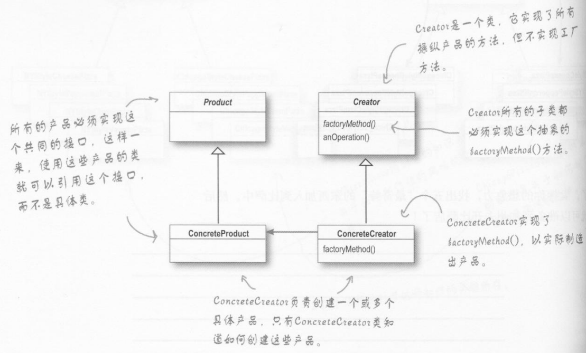

## 工厂方法的代码实现：

1. 定义个一个 pizza 的基类（抽象类）

```java
/**
 * 工厂方法模式，定义了一个创建对象的接口，但由子类决定要实例化的类是哪一个。工厂方法让类把实例化推迟到了子类
 *
 * 但是这里的 “决定” 并不是指模式允许子类本身在运行时做决定，而是指在编写创建者类时，
 * 不需要知道实际创建的产品是哪一个。选择了使用哪个子类，自然就决定了实际创建的产品是什么。
 */
public abstract class Pizza {
    protected String name;
    protected String dough;
    protected String sauce;
    protected List<String> topping = new ArrayList<>();


    public void prepare(){
        System.out.println("Preparing..." + name);
        System.out.println("Tossing dough");
        System.out.println("Adding sauce");
        System.out.println("Adding toppings: ");

        for (int i = 0; i < topping.size(); i++) {
            System.out.println("  " + topping.get(i));
        }
    }

    public void bake(){
        System.out.println("Bake for 25 minutes at 350");
    }

    public void cut(){
        System.out.println("Cutting the pizza into diagonal slices");
    }
    public void box(){
        System.out.println("Place pizza in offical PizzaStore box");
    }

    public String getName(){
        return this.name;
    }
}

```

<!--more-->

2. 一些 pizza 的实现类

```java
/**
 * @author wanghaoyu
 * @date 2018/10/22 - 20:43
 */
public class NYStyleClamPizze extends Pizza {
    public NYStyleClamPizze(){
        name = "NYStyleClamPizze";
        dough = "NYStyleClamPizze...Dough";
        sauce = "NYStyleClamPizze...Sauce";

        topping.add("NYStyleClamPizze.....");
    }
}
//======================================================
  public class NYStyleCheesePizza extends Pizza {
    public NYStyleCheesePizza(){
        name = "NYStyleCheesePizza";
        dough = "NYStyleCheesePizza...Dough";
        sauce = "NYStyleCheesePizza...Sauce";

        topping.add("NYStyleCheesePizza.....");
    }
}
//=================================================================

public class ChicagoStyleClamPizze extends Pizza {
    public ChicagoStyleClamPizze(){
        name = "ChicagoStyleClamPizze";
        dough = "ChicagoStyleClamPizze...Dough";
        sauce = "ChicagoStyleClamPizze...Sauce";

        topping.add("ChicagoStyleClamPizze.....");
    }
}
//=================================================================
public class ChicagoStyleCheesePizza extends Pizza {
    public ChicagoStyleCheesePizza(){
        name = "ChicagoStyleCheesePizza";
        dough = "ChicagoStyleCheesePizza...Dough";
        sauce = "ChicagoStyleCheesePizza...Sauce";

        topping.add("ChicagoStyleCheesePizza.....");
    }
}
```

3. 定义一个创建 pizza 工厂的接口

```java
/**
 * PizzaStroe 是抽象的
 */
public abstract class PizzaStore {
    /**
     * 加工 pizza
     */
    public Pizza orderPizze(String type){
        Pizza pizza;
        //creeatPizza() 方法从工厂对象中移回 pizzaStore
        pizza = creatPizza(type);

        pizza.prepare();
        pizza.bake();
        pizza.cut();
        pizza.box();

        return pizza;
    }

    /**
     * 把工厂对象移到这个方法中，
     */
    protected abstract Pizza creatPizza(String type);
}
```

4. 继承 PizzaStore 并实现 creatPizza() 方法

```java
public class ChicagoStylePizzaStore extends PizzaStore {
    @Override
    protected Pizza creatPizza(String type) {
        Pizza pizza = null;

        if (type.equals("cheese")){
            pizza = new ChicagoStyleCheesePizza();
        }else if (type.equals("clam")){
            pizza = new ChicagoStyleClamPizze();
        }
        return pizza;
    }
}
//=========================================================
public class NYStylePizzaStore extends PizzaStore {
    @Override
    protected Pizza creatPizza(String type) {
        Pizza pizza = null;

        if (type.equals("cheese")){
            pizza = new NYStyleCheesePizza();
        }else if (type.equals("clam")){
            pizza = new NYStyleClamPizze();
        }
        return pizza;
    }
}
```

5. 看一看，我们的成果

```java
public class Main {

    public static void main(String[] args) {
        PizzaStore nyStore = new NYStylePizzaStore();
        PizzaStore chicagoStore = new ChicagoStylePizzaStore();

        Pizza pizza = nyStore.orderPizze("cheese");

        System.out.println(pizza.getName());
        System.out.println("*******************************************");

        pizza = chicagoStore.orderPizze("cheese");
        System.out.println(pizza.getName());
    }
}
```

这是我们的运行结果：


## 适用性：

在下列情况下可以使用 Factory Method 模式：

 + 当一个类不知道它所必须创建的对象的类的时候。
 + 当一个类希望由它的子类来指定它所创建的对象的时候。
 + 当类将创建对象的职责委托给多个帮助子类中的某一个，并且你希望将哪一个帮助子类是代理者这一信息局部化的时候。

## 结构：



## 参与者

 +  Product(Pizza)

    定义工厂方法所创建的对象的接口。

+ ConcreteProduct(NYStyleClamPizze)

  实现 Product 接口。

+ Creator(PizzaStore)

  - 声明工厂方法，该方法返回一个 Product 类型的对象。Creator 也可以定义一个工厂方法的缺省实现，它返回一个缺省的 ConcreteProduct 对象。
  - 可以调用工厂方法以创建一个 Product 对象。

+ ConcreteCreator(NYStylePizzaStore)

  重新定义工厂方法以返回一个 ConcreteProduct 实例。

## 效果：

+ 工厂方法不再将与特定应用有关的类绑定到你的代码中。代码仅处理 Product 接口；因此，它可以与用户定义的任何 ConcreteProduct 类一起使用。
+ 工厂方法的一个潜在缺点在于客户可能仅仅为了创建一个特定的 ConcreteProduct 对象，就不得不创建 Creator 的子类。当 Creator 子类不必须时，客户现在必然要处理类演化的其他方面；但是当客户无论如何必须创建 Creator 的子类时，创建子类也是可行的。
+ **为子类提供挂钩（hook）**   用工厂方法在一个类的内部创建对象通常比直接创建对象更灵活。 Factory Method 给子类一个挂钩以提供对象的扩展版本。
+ **连接平行的类层次**   迄今为止，在我们所考虑的例子中，工厂方法并不往往只是被 Creator 调用，客户可以找到一些有用的工厂方法，尤其在平行类层次的情况下。


## 总结：


​	在工厂方法中，我们认识到，以后在编码过程中，**可以将创建对象的代码封装起来**。**实例化具体类的代码，很可能在以后经常需要改变，我们可以用 “工厂” 的技巧，将实例化的行为封装起来。**

​	那么这种 “工厂” 究竟能带来什么好处呢？

​	将创建对象的代码集中在一个对象或方法中，可以避免代码的重复，并且更方便以后的维护。这也意味着客户在实例化对象时，只会依赖于接口，而不是具体类。我们在学习中发现，这可以帮助我针对接口编程，而不是针对实现编程。这让代码更具有弹性，可以应对未来的扩展。

​	但是，我们常常会有这样一个疑问。

​	**我知道封装起创建对象的代码，就可以对抽象编程，将客户代码和真实的实现解耦。然而在我的工厂代码中，不可避免地，任然必须使用具体类来实例化真正的对象。这不是 “蒙着眼睛骗自己” 吗？**

​	**对象的创建是现实的，如果不创建任何对象，就无法创建任何 java 程序。然而， 利用这个显示的知识，可以将这些创建对象的代码用栅栏围起来，就像你把所有的羊毛堆在眼前一样，一旦围起来后，就可以保护这些创建对象的代码。如果让创建对象的代码到处乱跑，那就无法收集到 "羊毛"，你说是吧？**


**设计原则： 要依赖于抽象，不要依赖于集体类。**

具体该怎么做呢？

 +  变量不可以持有具体类的对象。（如果使用 new ，就是持有具体类的引用。你可以改用工厂来避开这样的做法）

 +  不要让类派生自具体类。（如果派生自具体类，你就会依赖具体类。请派生自一个抽象<接口或抽象类>）

 +  不要覆盖基类中已实现的方法。（如果覆盖基类已实现的方法，那么你的基类就不是一个真正适合被继承的抽象。积累中已实现的方法，应该有所有的子类共享）

    当然正如我们许多的原则一样，应该尽量达到这个原则，而不是随时都要遵守这个原则。例如，我们平时会不假思索的实例化字符串对象，这就违反了这个原则，但是为什么可以这么做呢？因为字符串不可能改变。另一方面，如果有类可能改变，你可以采用一些好的技巧来封装改变（例如工厂方法）。


## 工厂方法设计模式中，我们会产生的疑问：


### 1. 当只有一个 ConcreteCreator 的时候，工厂方法模式有什么优点？

​	尽管只有一个具体创建者，工厂方法模式依然很有用，因为它帮助我们将产品的 “实现” 从“使用” 中解耦出来。如果增加产品或改变产品的实现，Creator 并不会受影响**（因为 Creator 与任何 ConcreteProduct 之间都不是紧耦合）。**

### 2. 如果说纽约和芝加哥的商店是利用简单工厂创建的，这样的说法是否正确？看起来倒是很像。

​	它们很类似，但用法不同。虽每个具体商店的实现看起来都很像是 SimplePizza-Factory， 但是别忘了，**工厂方法的具体商店是扩展自一个类（PizzaStore），此类有一个抽象方法 createPizza()。 由每个商店自行负责 createPizza() 方法的行为。在简单工厂中，工厂是另一个由 PizzaStore 使用的对象。**

## 3. 工厂方法和创建者是否总是抽象的？

​	不一定，可以定义一个默认的工厂方法来产生某些具体的产品，这么一来，即使创建者没有任何子类，依然可以创建产品。

## 4. 每个商店基于传入的类型制造出不同种类的 pizza 。是否所有的具体创建者都必须如此？能不能只创建一种 pizza？

​	这里采用的方式是 “参数化工厂方法” 。他可以根据传入的参数创建不同的对象。然而，工厂经常只产生一种对象，不需要参数化。模式的这两种形式都是有效的。

## 5. 利用字符串传入参数化类型，似乎有点危险，万一把 clam(蛤蜊) 英文拼错，成了 calm （平静），要求供应 calmPizza 怎么办？

​	说的很对，这样的情形会造成 运行时异常。**那么我们可以在编译器就将参数上的错误挑出来，就可以避开这个问题了。** 

- 可以创建代表参数类型的对象。
- 使用枚举类型 enum。

## 6. 对于简单工厂和工厂方法之间的差异，我依然感到困惑。它们看起来很类似，差别在于，在工厂方法中，返回 pizza 的类是子类。能解释一下吗？

​	子类的确看起来很像简单工厂。简单工厂把全部事情在一个地方都处理完了，然而工厂方法却是创建一个框架，让子类决定要如何实现。

​	比方说在工厂方法中，orderPizza() 方法提供了一般的框架，以便创建 pizza，orderPizza() 方法依赖工厂方法创建具体类，并创建出实际的 pizza 。可通过继承 pizzaStore 类，决定实际创造出的 pizza 是什么。

​	简单工厂的做法是将对象的创建封装起来，简单工厂不具备工厂方法的弹性，因为简单工厂不能变更正在创建的产品。

